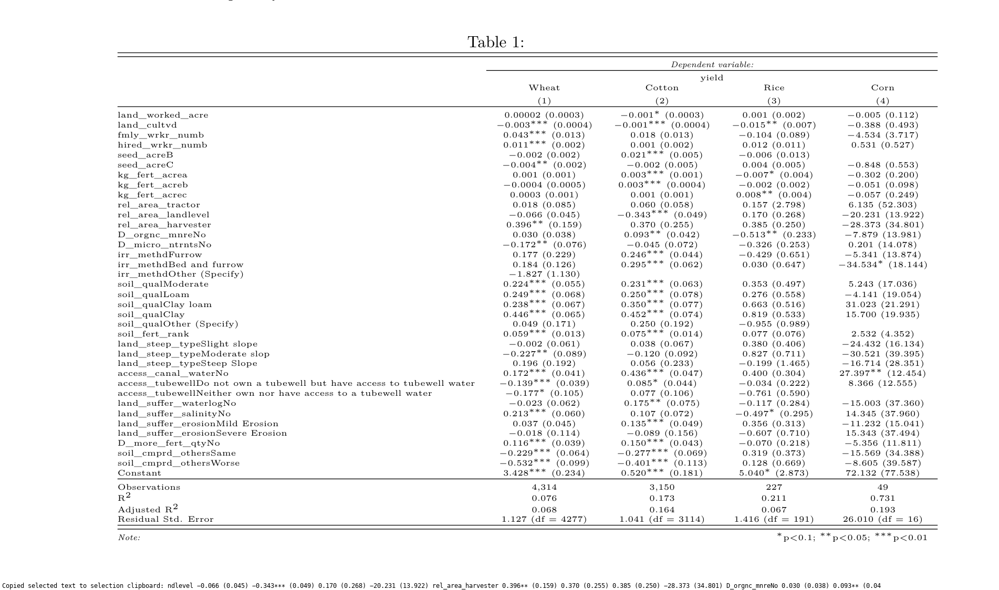

```{r, echo=FALSE, message=FALSE, results='hide'}
knitr::opts_chunk$set(echo = FALSE)
knitr::opts_chunk$set(warning = FALSE)
knitr::opts_chunk$set(message = FALSE)

library(tidyverse)
library(patchwork)
library(ggthemes)
library(knitr)
library(broom)
library(haven)

base_year = 2019

df_full <- read_stata("data/DEV309_FullDataset_2019.dta")

# Global data
yields_global   <- read_csv("data/yields-global.csv")
volumes_global  <- read_csv("data/volumes-global.csv")

values_global   <- read_csv("data/values-global.csv")

production_all  <- read_csv("data/production-crops-all-normalized.csv") # this makes yields and volumes all redundant

country_codes <- read_csv("data/wikipedia-iso-country-codes.csv")

cc_map <- country_codes %>%
    select(`Alpha-3 code`, `English short name lower case`, `Numeric code`)

production_global <- production_all %>% 
    select(Year, Area, `Area Code (M49)`, `Item Code`, Item, Element, Unit, Value) %>%
    filter(Unit %in% c("ha", "hg/ha", "tonnes"))

values_global_minimal <- values_global %>%
    select(Year, `Area Code (M49)`, Area, `Item Code` = `Item Code (FAO)`, Item, Element, Unit, Value)

global_agri_data <- rbind(production_global, values_global_minimal) %>%
    mutate(
           `Area Code` = str_replace(`Area Code (M49)`, "'", "")
    ) %>%
    select(-`Area Code (M49)`) %>%
    left_join(cc_map, by=c("Area Code" = "Numeric code")) %>%
    rename(
           "countrycode" = "Alpha-3 code",
           "year" = "Year"
    ) %>%
    select(-"English short name lower case")

global_agri_wide <- global_agri_data %>%
    select(-Unit) %>%
    filter(year >= 1991) %>%
    pivot_wider(names_from="Element", values_from="Value") %>%
    rename(`Gross Production Value` = `Gross Production Value (constant 2014-2016 thousand US$)`) %>%
    mutate(
           `Gross Production Value` = `Gross Production Value` * 1000,
           econ_yield = `Gross Production Value` / `Area harvested`,
           price = `Gross Production Value` / Production
    )

# TODO: better list of comparators
# comparators <- (df_full %>% 
#     filter(regionname == "South Asia") %>% 
#     filter(countrycode != "MDV") %>%
#     select(countrycode) %>% 
#     unique())$countrycode

comparators <- c("PAK", "AFG", "BGD", "BTN", "IND", "LKA", "NPL") 
                 # "VNM", "EGY", "IDN", "MAR", "MMR", "PHL")

```

```{r}
# prepare data
inds <- c(
          "Agri GDP Share"  = "WB_nv_agr_totl_zs",
          "Agri Value Added (current US$)" = "WB_nv_agr_totl_cd",
          "Agri Value Added (constant 2010 US$)" = "WB_nv_agr_totl_kd",
          "GDP per capita (constant 2010 US$)" = "WB_ny_gdp_pcap_kd",

          "Agri Employment" = "WB_sl_agr_empl_zs",
          "Agri Female Employment" = "WB_sl_agr_empl_fe_zs",
          "Agri Male Employment" = "WB_sl_agr_empl_ma_zs",
          "pop-working-age" = "WB_sp_pop_1564_to_zs",
          "population" = "WB_sp_pop_totl",
          "pop-working-age-female" = "WB_sp_pop_1564_fe_in",
          "pop-working-age-male" = "WB_sp_pop_1564_ma_in",
          "pop-working-age2" = "WB_sp_pop_1564_to",

          "Agricultural Land" = "WB_ag_lnd_agri_k2",
          "Arable Land" = "WB_ag_lnd_arbl_ha",
          "Cereal yield" = "WB_ag_yld_crel_kg",
          "Irrigated Land" = "WB_ag_lnd_irig_ag_zs",
          "Irrigated Land2" = "QG_fao_luagrirrac"
        )

cc_prod_data_all <- df_full %>%
    select(year, countrycode, regionname, adminregion, incomelevel, {{inds}}) %>%
    mutate(
           # agri_employ = `Agri Employment` * (`pop-working-age` * population),
           agri_employ = `Agri Employment`/100 * `pop-working-age2`,
           agri_prod = `Agri Value Added (constant 2010 US$)` / agri_employ,
           agri_fem_employ = `Agri Female Employment`/100 * `pop-working-age-female`,
           agri_male_employ = `Agri Male Employment`/100 * `pop-working-age-male`,

           va_per_hectare = `Agri Value Added (constant 2010 US$)` / `Arable Land`,
           va_growth = (`Agri Value Added (constant 2010 US$)` - lag(`Agri Value Added (constant 2010 US$)`) ) / lag(`Agri Value Added (constant 2010 US$)`) 
    )

global_crop_shares <- global_agri_wide %>%
    filter(!is.na(`Area harvested`)) %>%
    filter(!is.na(`Gross Production Value`)) %>%
    group_by(countrycode, year) %>%
    arrange(-`Gross Production Value`) %>%
    mutate(
           prod_share = `Gross Production Value` / sum(`Gross Production Value`),
           area_share = `Area harvested` / sum(`Area harvested`)
    ) %>%
    ungroup()

lag_diff <- 19
global_crop_changes <- global_crop_shares %>%
    group_by(countrycode, Item) %>%
    arrange(year) %>%
    mutate(
           prev_area = lag(`Area harvested`, lag_diff),
           prev_yield = lag(Yield, lag_diff),
           prev_prod = lag(Production, lag_diff),
           prev_prod_val = lag(`Gross Production Value`, lag_diff),
           prev_prod_share = lag(prod_share, lag_diff),
           prev_area_share = lag(area_share, lag_diff),
           prev_price = lag(price, lag_diff),
           prev_econ_yield = lag(econ_yield, lag_diff),

           prod_growth = (Production - prev_prod)/prev_prod * 100,
           prod_val_growth = (`Gross Production Value` - prev_prod_val)/prev_prod_val * 100,
           area_growth = (`Area harvested` - prev_area) / prev_area * 100,
           prod_share_growth = (prod_share - prev_prod_share)/prev_prod_share * 100,
           area_share_growth = (area_share - prev_area_share)/prev_area_share * 100,
           price_growth = (price - prev_price)/prev_price * 100,
           yield_growth = (Yield - prev_yield)/prev_yield * 100,
           econ_yield_growth = (econ_yield - prev_econ_yield) / prev_econ_yield * 100
    ) 

```

Pakistan produces less value add per hectare of Arable land than all of South Asia, barring Afghanistan. Growth in total value add has been the slowest in the region, while the amount of Arable land remains constant. At the same time, growth rates in both male and female agricultural workers is the highest in the region. Ultimately this results in the lowest value added per worker growth in the region. In Pakistan, more and more people produce less and less from the ground year after year. We aim to examine the constraints to Agri productivity in the country. 

```{r fig.height = 10, fig.width=10}

va_hectare_time <- cc_prod_data_all %>%
    filter(regionname == "South Asia") %>%
    filter(countrycode != "MDV") %>%
    ggplot(aes(x=year, y=va_per_hectare, color=countrycode, label=countrycode)) +
    geom_line() +
    geom_text(data =. %>% filter(year == 2016), nudge_x = 2) +
    theme_few() +
    theme(legend.position = "none") + 
    labs(
         title = "Agriculture Value Added per Hectare of Arable Land",
         subtitle = "South Asia",
         y = "",
         x = ""
    )

va_worker_time <- cc_prod_data_all %>%
    filter(regionname == "South Asia") %>%
    filter(!is.na(agri_prod)) %>%
    filter(year == base_year) %>%
    ggplot(aes(x=reorder(countrycode, -agri_prod), y=agri_prod)) +
    geom_bar(stat="identity") + 
    geom_bar(data = . %>% filter(countrycode == "PAK"), fill="orange", stat="identity") + 
    theme_few() +
    labs(
         title = "Value Added per Worker",
         subtitle = paste("Agriculture", base_year),
         y = "",
         x = ""
    )

decompose_hectare_df <- cc_prod_data_all %>%
    group_by(countrycode) %>%
    arrange(year) %>%
    mutate(
           prev_arable_land = lag(`Arable Land`, 16),
           arable_land_change = (`Arable Land` - prev_arable_land)/prev_arable_land * 100,

           prev_va_per_hectare = lag(va_per_hectare, 16),
           va_per_hectare_growth = (va_per_hectare - prev_va_per_hectare)/prev_va_per_hectare * 100
    ) %>%
    ungroup()

growth_hectare <- decompose_hectare_df %>%
    filter(regionname == "South Asia") %>%
    filter(year == 2016) %>%
    filter(!is.na(va_per_hectare_growth)) %>%
    ggplot(aes(x=reorder(countrycode, va_per_hectare_growth), y=va_per_hectare_growth)) +
    geom_bar(stat="identity") +
    geom_bar(data = . %>% filter(countrycode == "PAK"), fill="orange", stat="identity") +
    theme_few() + 
    labs(
         title = paste("Value Added per Hectare"),
         subtitle = paste("Growth between 2016 and", 2016 - 16),
         x = "Country",
         y = ""
    )

n_base_year <- 2000
target_year <- 2019

growth_dat <- cc_prod_data_all %>%
    group_by(countrycode) %>%
    arrange(year) %>%
    filter((year == n_base_year) | (year == target_year)) %>%
    mutate(
        growth = (lead(agri_prod) - agri_prod) / agri_prod * 100
    ) %>%
    filter(year == n_base_year) %>%
    filter(!is.na(growth))

growth_worker <- growth_dat %>%
    filter(regionname == "South Asia") %>%
    ggplot(aes(x=reorder(countrycode, growth), y=growth)) +
    geom_bar(stat="identity") +
    geom_bar(data = . %>% filter(countrycode == "PAK"), fill = "orange", stat="identity") +
    theme_few() + 
    theme(legend.position = "none") + 
    labs(
            title = "Growth in Agri Value Added per Worker" ,
            subtitle = paste(n_base_year, "to", target_year),
            x = "Country",
            y = ""
    )


va_hectare_time / (va_worker_time | growth_worker)

```

We find that the low growth in value added in Pakistan is primarily due to changes in yields per crop over time, rather than through price changes. (Note - price data through FAO is still suspicious, and may need to come back to it). 

The figure below shows the percent growth in yields for crops, ranked by how much of the production share it is responsible for. It demonstrates that yield growth for the most important crops in Pakistan have been low relative to other South Asian countries. 

```{r fig.height=10, fig.width=12}

# global_crop_changes %>%
#     filter(countrycode %in% comparators) %>%
#     filter(year == base_year) %>%
#     group_by(countrycode) %>%
#     arrange(-prev_prod_share) %>%
#     mutate(
#            position = row_number(),
#            prod_share_position = cumsum(prod_share) - prod_share
#     ) %>%
#     ungroup() %>%
#     mutate(Item = str_trunc(Item, 10)) %>%
#     ggplot(aes(x=position, y=yield_growth)) +
#     geom_bar(stat="identity", position="dodge") +
#     theme_few() +
#     scale_fill_viridis_b() +
#     facet_wrap(~countrycode) +
#     theme(axis.text.x = element_text(angle = 45, vjust=0.9)) +
#     labs(
#          title = "Growth in Yield per Crop (KG/Ha)",
#          subtitle = paste("Between", base_year - lag_diff, "and", base_year),
#          x = "Rank of how important this crop used to be",
#          y = "% Growth"
#     )

global_crop_changes %>%
    filter(countrycode %in% comparators) %>%
    filter(year == base_year) %>%
    group_by(countrycode) %>%
    arrange(-prev_prod_share) %>%
    mutate(
           position = row_number(),
           prod_share_position = cumsum(prev_prod_share) - prev_prod_share
    ) %>%
    ungroup() %>%
    mutate(Item = str_trunc(Item, 15)) %>%
    ggplot(aes(
               xmin = prod_share_position * 100, 
               xmax = ((prod_share_position + prev_prod_share)*100),
               ymin = 0,
               ymax = yield_growth
    )) +
    geom_rect() +
    geom_text(data = . %>% 
              filter(prev_prod_share > 0.04), 
          aes(
              label = Item,
              hjust = "left",
              angle = 65,
              x = (prod_share_position + prev_prod_share/2) * 100, 
              y = yield_growth),
              nudge_y = 100) +
    theme_few() +
    # scale_fill_viridis_b() +
    facet_wrap(~countrycode) +
    theme(axis.text.x = element_text(angle = 45, vjust=0.9)) +
    labs(
         title = "Growth in Yield per Crop (KG/Ha)",
         subtitle = paste("Between", base_year - lag_diff, "and", base_year),
         x = paste("Share of Crop Production in", base_year - lag_diff),
         y = "% Growth in Yield"
    )

```

The following figure demonstrates this through a different metric. We can observe Pakistans competitiveness in its top crops against the median south asian performance. With few exceptions, we see relative yields declining from 2000 to 2020. 

```{r fig.height=10, fig.width=10}

world_rel_dat <- global_crop_changes %>%
    group_by(year, Item) %>%
    mutate(
           rel_world_yield = Yield / median(Yield, na.rm = T),
           rel_world_price = price / median(price, na.rm = T)
    )

global_crop_changes %>%
    filter(countrycode %in% comparators) %>%
    group_by(year, Item) %>%
    mutate(
           rel_yield = Yield / median(Yield, na.rm = T),
           rel_price = price / median(price, na.rm = T)
    ) %>%
    left_join(world_rel_dat) %>%
    ungroup() %>%
    pivot_longer(c("rel_yield", "rel_world_yield")) %>%
    filter(countrycode == "PAK") %>%
    filter(year >= 2000) %>%
    filter(prod_share > 0.02) %>%
    filter(!(Item %in% c("Onions and shallots, dry (excluding dehydrated)"))) %>%
    ggplot(aes(x=year, y=value, linetype=name)) +
    geom_hline(yintercept = 1, linetype = "dotted") +
    geom_line() +
    theme_few() + 
    facet_wrap(~Item, scales="free_y")  +
    scale_linetype(labels=c("Median World", "Median South Asia")) +
    labs(
         title = "Pakistan Crop Competitiveness over Time",
         y = "Relative Yield",
         x = "",
         linetype = "Yield Relative to"
    )

# global_crop_changes %>%
#     group_by(year, Item) %>%
#     mutate(
#            rel_yield = Yield / median(Yield, na.rm = T),
#            rel_price = price / median(price, na.rm = T)
#     ) %>%
#     ungroup() %>%
#     filter(year >= 2000) %>%
#     filter(countrycode == "PAK") %>%
#     filter(prod_share > 0.01) %>%
#     ggplot(aes(x=year, y=rel_yield)) +
#     geom_hline(yintercept = 1, linetype = "dashed") +
#     geom_line() +
#     theme_few() + 
#     facet_wrap(~Item, scales="free_y")  +
#     labs(
#          title = "Pakistan Crop Yields over Time Relative to Median World Yield",
#          y = "Relative Yield",
#          x = ""
#     )

# TODO: can put into one picture
```

Important exceptions are corn and sugarcane. A look at the relative yields and relative prices tells us a bit more about the positioning of these crops, using price as a proxy for quality. (The price data is a bit susipicious still, but think it is signalling that markets need to be looked at).   
```{r fig.height=10, fig.width=11}

global_crop_changes %>%
    filter(countrycode %in% comparators) %>%
    filter(year > 2000) %>%
    # filter(Item %in% crop_changes_table$Item) %>%
    group_by(year, Item) %>%
    mutate(
           rel_yield = Yield / median(Yield, na.rm = T),
           rel_price = price / median(price, na.rm = T)
    ) %>%
    ungroup() %>%
    # arrange(year) %>%
    filter(year == base_year) %>%
    filter(countrycode == "PAK") %>%
    filter(prod_share > 0.005) %>%
    ggplot(aes(x=rel_price, y=rel_yield, color=`prod_share`)) +
    geom_vline(xintercept = 1, linetype = "dashed") +
    geom_hline(yintercept = 1, linetype = "dashed") +
    geom_point(data = . %>% filter(year == base_year), aes(size=`Area harvested`)) +
    geom_text(data = . %>% filter(year == base_year), aes(label=Item), nudge_y = -0.015, nudge_x = 0.025) +
    theme_few() + 
    labs(
         title = "Relative Yield vs Relative Price",
         subtitle = paste("Comparison vs Comparator countries,", base_year),
         y = "Yield Relative to Median Yield",
         x = "Price Relative to Median Price"
    )

```

Pakistan has become increasingly uncompetitive in wheat, cotton and rice production, while it has increased its competitiveness in corn and sugarcane. Wheat and rice are of relatively higher quality than in the rest of south asia - using price as a proxy - while cotton, sugar and maize are less. There appears to be a tradeoff between higher yields and lower quality. 

The analysis should then examine what has happened with these crops over time. Using farm-level data on Wheat and cotton, we can begin to get a picture. 

Some takeaways, focusing on Wheat and Cotton. 

\begin{itemize}

    \item The more land allocated for the crop, the less the yield.
    \item Wheat responds to increased workers, while cotton does not. 
    \item Cotton Yields respond to increased use of own seed. Wheat Yield decreases with increase of purchased seed
    \item Cotton yields appear to respond to increased usage of fertilizer, while Wheat does not.
    \item Use of land leveler on a larger proportion of land appears to decrease Cotton yields 
    \item Use of harvester on a large proportion of land is associated with higher Wheat yields 
    \item Use of Organic Manure is associated with lower cotton yields 
    \item Use of micronutrients is associated with higher wheat yields 
    \item Both Furrow and Bed and Furrow irrigation methods are associated with higher cotton yields compard to flooding.
    \item No noticeable distinction in yield for Wheat based on irrigation method 
    \item Both cotton and wheat prefer Clay soil types 
    \item Farmers ranking of soil fertility is positively correlated with higher yields 
    \item Flat land is associated with higher wheat yields 
    \item Access to canal water is associated with lower wheat and cotton yields 
    \item Owning a tubewell is associated with higher wheat yields. 
    \item Cotton yields are higher when land is not waterlogged 
    \item Wheat yields are higher when there is no salinity 
    \item Mildly eroded land is apparently associated with higher cotton yields 
    \item Farmers appear to have a good sense of their soil quality 

\end{itemize}


